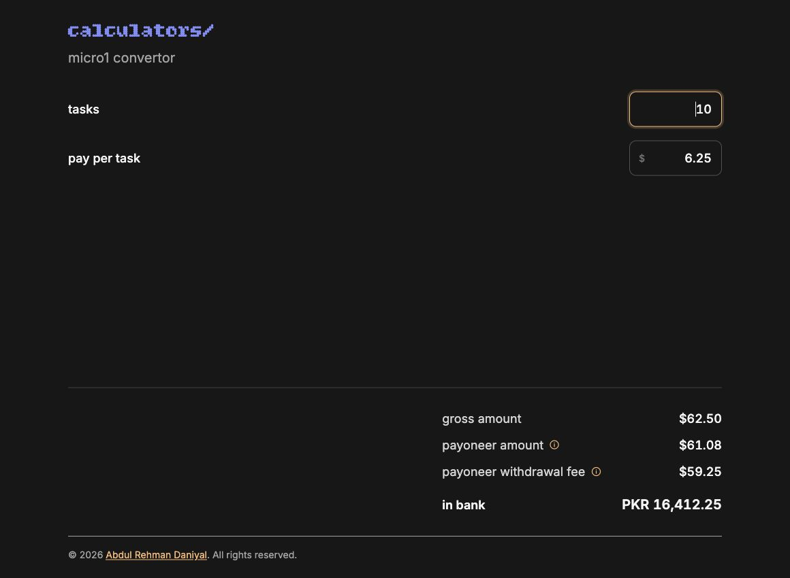

# calculators

A small collection of focused calculation tools built for personal use.



## included

### micro1 convertor

Estimates the amount received in a Pakistani bank account after:

- Deel's fixed `$1.42` transfer fee
- Payoneer's `3%` withdrawal fee
- Conversion at `277 PKR` per USD

Values update instantly as the task count or pay-per-task amount changes.

## development

```sh
pnpm install
pnpm dev
```

Create a production build with:

```sh
pnpm build
```

Built with [Astro](https://astro.build/) and [Svelte](https://svelte.dev/).
